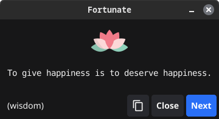

# Fortunate

[![License][License-Image]][License-URL] [![ReportCard][ReportCard-Image]][ReportCard-URL] [![Build][Build-Status-Image]][Build-Status-URL] [![Release][Release-Image]][Release-URL]

**Fortunate** is an open-source motivational app for Linux and macOS that delivers uplifting quotes and thoughtful messages. Powered by `fortune-mod`, it offers both a clean graphical interface and system notifications to keep you inspired throughout your day.



## Table of Contents

- [Features](#features)
- [Package Install](#package-install)
- [Source Build/Install](#source-buildinstall)
- [Usage](#usage)
- [Configuration](#configuration)
- [Custom Fortune Collections](#custom-fortune-collections)
- [License](#license)
- [Acknowledgments](#acknowledgments)

## Features

- **Dual Display Modes**:
  - Beautiful graphical window for focused inspiration
  - Unobtrusive system notifications for passive motivation
- **Customizable Experience**:
  - Choose from classic fortune collections
  - Configure notification frequency and display preferences
  - Select specific fortune databases to match your mood
- **Modern Interface**: Clean and intuitive design powered by the Fyne GUI toolkit
- **System Integration**: Runs seamlessly in your system tray with dark/light theme support
- **Resource Efficient**: Written in Go for minimal system impact

## Package Install

**Arch Linux**

```bash
yay -S fortunate
```

## Source Build/Install

### Dependencies

**Arch Linux**

```bash
sudo pacman -S git make go gcc pkg-config xorg-server-devel libxcursor libxrandr libxinerama libxi fortune-mod
```

**Debian/Ubuntu**

```bash
sudo apt-get install git make golang gcc libgl1-mesa-dev xorg-dev fortune-mod
```

**Fedora**

```bash
sudo dnf install git make golang gcc libXcursor-devel libXrandr-devel mesa-libGL-devel libXi-devel libXinerama-devel libXxf86vm-devel fortune-mod
```

**macOS**

First install XCode and then execute:

```bash
brew install golang fortune
```

### Build and Install

```bash
# Clone the repository
git clone https://github.com/zquestz/fortunate

# Change to project directory
cd fortunate

# Build the project
make

# Linux Install
sudo make install

# macOS Install
make install-darwin
```

## Usage

### Basic Usage

- Launch Fortunate from your applications menu or run `fortunate` in your terminal
- The application runs in your system tray or menubar (look for the lotus icon)

**System Tray**

- Left-click the tray icon to display a fortune
- Right-click the tray icon to access the menu:
  - Display Fortune
  - Notify Fortune
  - Settings
  - About
  - Quit

**Menubar**

- Click the menubar icon to access the menu:
  - Display Fortune
  - Notify Fortune
  - Settings
  - About
  - Quit

### Command Line Options

```pre
fortunate [flags]

Flags:
  -h, --help      help for fortunate
      --version   display version
```

## Configuration

Fortunate can be customized through the settings window, accessible from the tray icon:

### Settings Options

- **Icon Theme**: Choose your preferred icon theme
- **Fortune Timer**: Set how often fortunes appear as notifications
- **Fortune Length**: Choose between Short and/or Long fortunes
- **Show Cookie**: Toggle fortune cookie display
- **Fortune Lists**: Select which fortune databases to use

## Custom Fortune Collections

This repository includes additional custom fortune collections located in `fortunes/`. These collections offer inspiring and thoughtful quotes focused on different themes.

### Available Collections

- **appreciation**: A collection of quotes and thoughts about gratitude, mindfulness, and finding beauty in everyday moments. Features wisdom from various thinkers like Voltaire, Cicero, and John F. Kennedy.

- **inspiration**: Uplifting quotes and reflections about wonder, possibility, and the magic in everyday life. Includes thoughts from authors like C.S. Lewis, W.B. Yeats, and Alice Walker.

- **motivation**: Empowering quotes focused on personal growth, inner strength, and taking action. Features wisdom from leaders and thinkers like Viktor Frankl, Thich Nhat Hanh, and Eleanor Roosevelt.

### Installation

The fortune directory location varies by distribution:

- Debian/Ubuntu/Fedora: `/usr/share/games/fortunes/`
- Arch Linux: `/usr/share/fortune/`
- macOS: `/usr/local/share/games/fortunes`

Copy the fortune files to your system's fortune directory:

```bash
# For Debian/Ubuntu/Fedora
sudo cp fortunes/* /usr/share/games/fortunes/

# For Arch Linux
sudo cp fortunes/* /usr/share/fortune/

# For macOS
cp fortunes/* /usr/local/share/games/fortunes/
strfile /usr/local/share/games/fortunes/appreciation
strfile /usr/local/share/games/fortunes/inspiration
strfile /usr/local/share/games/fortunes/motivation
```

Note: You may need to check your specific distribution's fortune directory location if it differs from these common paths.

### Usage

You can display a random fortune from a specific collection:

```bash
fortune appreciation
fortune inspiration
fortune motivation
```

Or include them in the general rotation with other fortune files:

```bash
fortune all
```

These collections aim to provide daily doses of wisdom, encouragement, and mindful reflection.

## License

Fortunate is licensed under the MIT License. See the [LICENSE](LICENSE) file for details.

## Acknowledgments

- [Fyne](https://fyne.io/) - GUI toolkit
- [fortune-mod](https://github.com/shlomif/fortune-mod) - Fortune database and utilities
- [Lotus icons created by bearicons - Flaticon](https://www.flaticon.com/free-icons/lotus)

[License-URL]: https://opensource.org/licenses/MIT
[License-Image]: https://img.shields.io/npm/l/express.svg
[ReportCard-URL]: https://goreportcard.com/report/zquestz/fortunate
[ReportCard-Image]: https://goreportcard.com/badge/github.com/zquestz/fortunate
[Build-Status-URL]: https://app.travis-ci.com/github/zquestz/fortunate
[Build-Status-Image]: https://app.travis-ci.com/zquestz/fortunate.svg?branch=main
[Release-URL]: https://github.com/zquestz/fortunate/releases/tag/v1.1.2
[Release-Image]: https://img.shields.io/badge/release-v1.1.2-1eb0fc.svg
